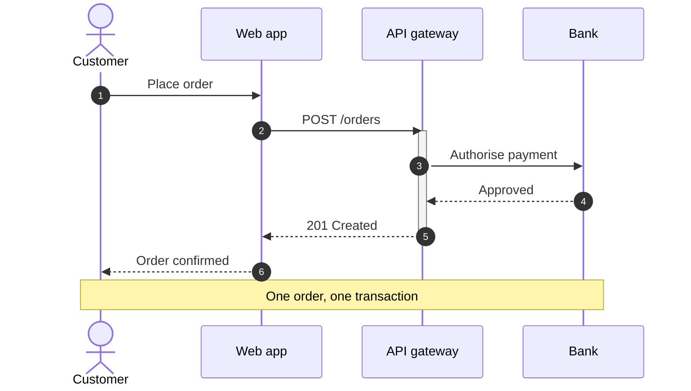
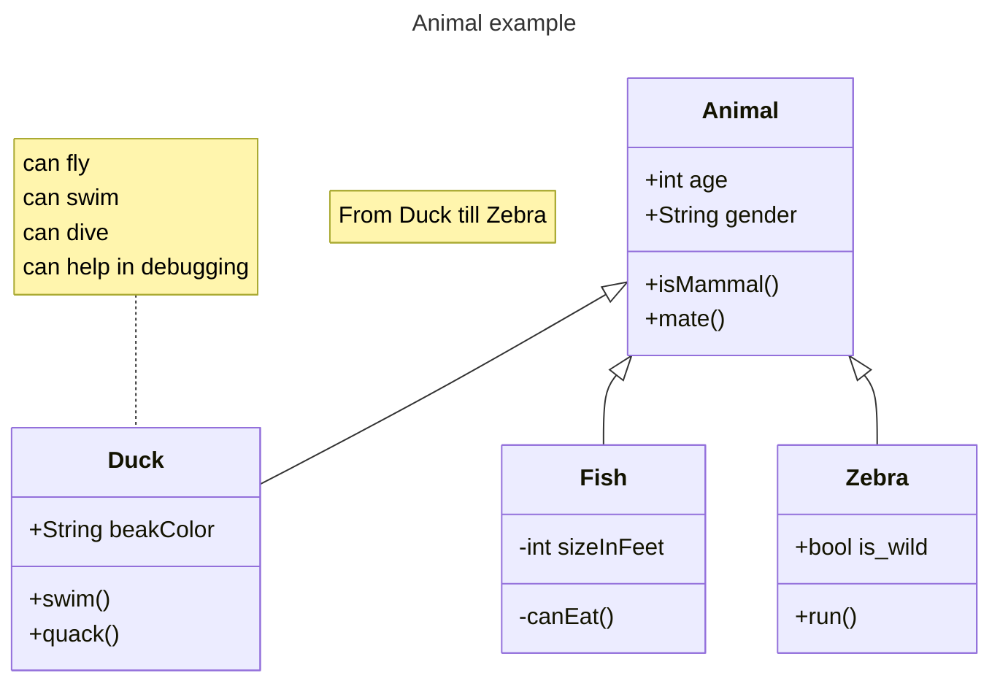

# 개발을 위한 컨벤션 모음

## 1. 프로젝트 폴더 구성

- 강사님이 가이드라인 제공시 우선적으로 수용 

- 별도의 지침이 없다면 회의를 거쳐 폴더 구성

## 📁 폴더 구조(임시)

- 프로젝트 에셋 및 스크립트는 `Assets/` 하위의 정해진 폴더 내에 분류하여 저장

- 루트(Root) 폴더에 정리가 안 된 임시 파일을 방치 금지

```
Docs/
    📁 DailyLogs/           # 개인 업무 일지
        📁 팀원 이름/       # 팀원별 폴더

    📁 Minutes/            # 회의록 

    📁 TechDocs/           # 개인 기술 문서
        📁 팀원 이름/       # 팀원별 폴더

Assets/
    📁 Imports/                # 프로젝트에 추가한 외부 에셋
        📁 Arts/               # 그래픽 관련 리소스 (원본 에셋 포함)
            📁 Animations/     # 애니메이션 및 애니메이터 컨트롤러
            📁 Fonts/          # 폰트 파일
            📁 Materials/      # 머티리얼 및 셰이더
            📁 Meshes/         # 3D 모델 파일 (.fbx 등)
            📁 Sprites/        # 2D 이미지, UI 스프라이트, 텍스처

        📁 Audio/              # 사운드 리소스
            📁 BGM/            # 배경음악
            📁 SFX/            # 효과음

    📁 Prefabs/            # 프리팹 (필요 시 기능/시스템별로 하위 폴더 생성)
        📁 Characters/     # 플레이어, NPC 
        📁 Environment/    # 지형, 장애물, 선로, 자원 등
        📁 UI/             # 팝업, HUD 등 UI 전용 프리팹

    📁 Scenes/             # 씬 파일
        📁 팀원 이름/      # 팀원별 폴더를 생성해 담당 씬 관리

    📁 Scripts/            # C# 스크립트 코드 (필요 시 기능별로 분류하여 하위 폴더 생성)
        📁 Core/           # 게임 매니저, 싱글톤, 메인 루프
        📁 Player/         # 플레이어 이동, 상호작용
        📁 UI/             # UI 컨트롤러 스크립트

    📁 Test/               # 개인 테스트용으로 만든 임시 파일 (더미 플레이어/재료 등)
        📁 팀원 이름/       # 팀원별 폴더
```

---
## 2. 폴더 및 파일 네이밍 컨벤션

### 1. 📂 폴더

- **PascalCase**를 사용, 복수형(Plural) 명사 사용

- 예시: `Scripts`, `Prefabs`, `Materials`, `Audio`, `Sprites`

### 2. 📄 스크립트 

- **PascalCase**를 사용

- 역할을 바로 파악할수 있도록 명명

- 예시)

  - **컨트롤러:** `PlayerController.cs`, `TrainController.cs`

  - **매니저:** `GameManager.cs`, `SoundManager.cs`, `TrackManager.cs`

  - **UI 스크립트:** `InventoryUI.cs`, `PauseMenuUI.cs`

### 🎬 씬

- **PascalCase**를 사용하며, 뒤에 `Scene` 접미사를 붙여 일반 에셋과 구분

- 예시: `TitleScene.unity`, `MainGameScene.unity`, `Test_PlayerScene.unity`

### 🧱 프리팹

- **PascalCase**를 사용

  - **UI 요소:** `UI_` 접두사를 붙여 목록 상단에 정리되도록 합니다. (`UI_OptionPopup.prefab`, `UI_HUD.prefab`)

### 🎨 이미지 / 스프라이트 / 텍스쳐

- **snake_case**를 사용

- `접두사_이름_상태/번호` 구조로 작성

  - `spr_`: 일반 2D 스프라이트 (`spr_tile_grass_01.png`, `spr_player_idle_01.png`)

  - `ui_`: UI 요소용 이미지 (`ui_btn_play.png`, `ui_icon_coin.png`)

  - `tex_`: 텍스처 및 머티리얼용 이미지 (`tex_rock_diffuse.png`)


### 🎨 머티리얼 및 애니메이션

- **PascalCase**를 사용, 식별을 위해 아래와 같은 접두사를 연결합니다.

  - **머티리얼:** `Mat_` (`Mat_Train.mat`, `Mat_Water.mat`)

  - **애니메이터 컨트롤러:** `AC_` 또는 `AnimController_` (`AC_Player.controller`)

  - **애니메이션 클립:** `Anim_` (`Anim_Player_Run.anim`, `Anim_Train_Move.anim`)

### 🎵 오디오

- **snake_case**를 사용. 스크립트와 동일하게 직관적으로 명명

  - `bgm_`: 배경음악 (`bgm_title.mp3`, `bgm_stage_01.wav`)

  - `sfx_`: 효과음 (`sfx_player_jump.wav`, `sfx_button_click.wav`)

---

## 3. 코드 컨벤션

### 1. 코드 네이밍

- 변수명은 기본 C# 컨벤션을 따라갑니다.

| 대상 | 표기법 | 예시 |
| --- | ------ | ---- |
| 지역 변수 | camelCase | `playerLevel` |
| 클래스·형식 이름 | PascalCase | `PlayerController` |
| public 멤버 | PascalCase | `MaxHealth` |
| protected/private 멤버 | _camelCase | `_currentHealth` |
| 상수 | 대문자, 단어 사이 밑줄 | `MAX_LEVEL`|

### 2. 코드 주석

클래스와 `public` / `protected` 멤버(필드, 메서드)에는 반드시 `///`를 사용하여 주석을 답니다.

코드를 읽었을 때 한 눈에 파악하기 어려운 경우(복잡한 로직, 버그를 피하기 위해 추가한 코드 등)에는 `//`를 사용하여 주석을 답니다.

예시)
```Csharp
/// <summary>
/// 오브젝트 풀로 Chunk를 관리하고, 타겟 위치에 따라 Chunk를 불러오며 활성화/비활성화시킨다.
/// </summary>
public class ChunkManager : MonoBehaviour
{
    //...

    /// <summary>
    /// 생성할 Chunk의 정보를 저장한다.
    /// </summary>
    /// <param name="chunkIndex"> 월드맵 기준 Chunk의 번호. </param>
    /// <param name="worldMap"> Chunk 정보가 저장된 월드맵. </param>
    /// <param name="material"> Chunk 전체의 material. </param>
    /// <param name="textureSize"> Texture 한 변의 픽셀 수. </param>
    /// <param name="atlasSize"> Texture atlas의 n 크기 (n x n). </param>
    public void SetChunkData(int chunkIndex, int[,] worldMap, Material material, float textureSize, float atlasSize)
    {
        //...
    }
}
```
```csharp
float padding = 0.5f / _textureSize; // Mipmap(texture) bleeding(Texture atlas 때문에 경계면에 작은 점들이 발생하는 것)을 막기 위해 padding을 넣는다.
```

---

## 4. 브랜치

- PR을 통해 병합이 완료되면, 구현이 완료된 브랜치는 삭제

### branch 네이밍

- `이름_구현하는내용`의 형태로 작성  

    ex) `chaea_playerMove`

---

## 5. 씬 및 프리팹

### 1. **자신의 씬** 폴더에서만 작업, 씬 소유자가 아니면 씬 수정 금지 

- **씬 열람**을 제외한 `저장` 등 충돌을 유발할 수 있는 행동 금지

### 2. **프리팹**도 씬과 마찬가지로 담당자외 수정 금지

- 테스트가 필요하다면 **담당자와 소통**한 뒤 복사본을 생성

---

## 6. 커밋 및 PR

### 1. 커밋 메시지

| 타입 (Type) | 설명 (Description) | 작성 예시 (Example) |
| :--- | :--- | :--- |
| **[Feat]** | 새로운 기능 추가 | `[Feat] 플레이어 더블 점프 기능 추가` |
| **[Fix]** | 버그 수정 | `[Fix] 충돌 판정 오류 수정` |
| **[Docs]** | 문서 수정 | `[Docs] README 설치 방법 업데이트` |
| **[Style]** | 기능 변경 없는 코드 정리 | `[Style] 들여쓰기 및 공백 정리` |
| **[Refactor]** | 기능 변경 없는 구조 개선 | `[Refactor] 아이템 관리 구조 개선` |
| **[Chore]** | 빌드, 설정, 패키지 등 작업 | `[Chore] .gitignore에 빌드 산출물 항목 추가` |

### 2. PR

- `PR 제목` 또한 커밋 메시지의 형태와 동일하게 사용

#### 업무 분리와 PR요청 인원 지정

- 업무의 일정 부분이 분리되어, 다른 팀원이 기능을 구현하는 경우

    - 브랜치를 통해 분리 가능하면, 새로운 브랜치 생성 후 독자적으로 PR 요청

    - 업무를 나눈 팀원끼리 협의 후 PR요청 인원을 지정

### 3. PR 승인 및 병합

- PR를 요청한 팀원이 있다면 다른 팀원이 함께 코드를 리뷰합니다.
  
- 개선 사항이 있다면 코멘트를 남깁니다.

- 개선 사항이 없다면 팀원은 PR 승인만 하고 팀장은 병합을 합니다.

---

## 7. 충돌 시 대응

### PR 및 병합 관리는 팀장이 관리

- 충돌이 발생한 경우, 모든 팀원은 팀장과 소통한 뒤 깃 명렁 실행 


## 8. 기술 문서

`Docs/TechDocs/<이름>/기능명.md`에 마크다운 파일을 추가합니다.

1. 각 클래스, 인터페이스의 역할을 적습니다.

2. [클래스 다이어그램](https://brownbears.tistory.com/577)을 그려서 주요 클래스, 인터페이스 간의 관계를 표현합니다.  
    (모든 클래스, 필드, 메서드를 넣지 않고 중요한 것만 넣습니다.)

3. 3개 이상의 클래스가 상호작용하는 경우, [시퀀스 다이어그램](https://coding-factory.tistory.com/806)을 그려 흐름을 나타냅니다.  
   (그리는 것이 어렵다면, 번호를 붙이며 흐름의 순서를 글로 표현합니다.)

### Mermaid
Mermaid를 사용하여 클래스 다이어그램, 시퀀스 다이어그램을 그릴 수 있습니다.  

VS Code의 Mermaid Plugin 다운로드 링크  
https://marketplace.visualstudio.com/items?itemName=MermaidChart.vscode-mermaid-chart


Mermaid 사용 방법  
https://mermaid.ai/open-source/syntax/classDiagram.html  
https://mermaid.ai/open-source/syntax/sequenceDiagram.html

예시)


